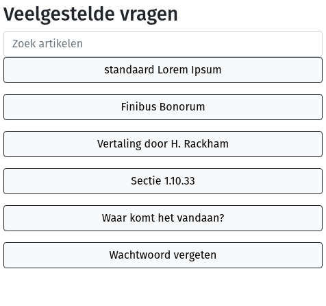
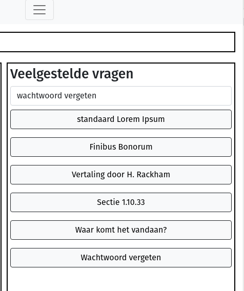
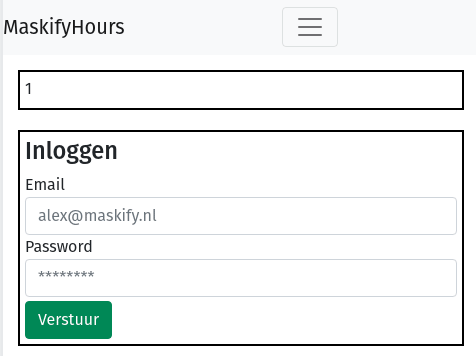
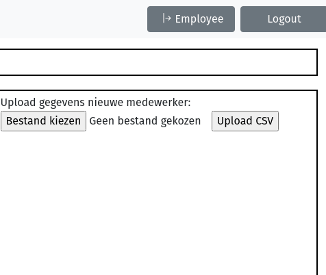
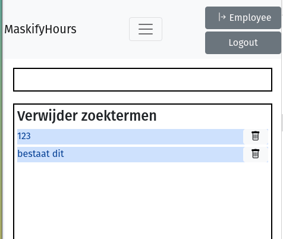
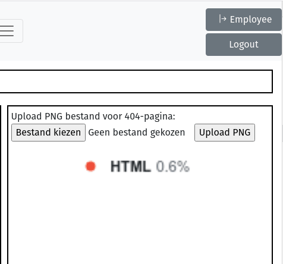

## Maskify Hour Registration Application

A school project to get started with PHP-OOP.  
Current version: 0.4.1

### How to install the project to a server?

**Prequisites:**  
Apache Server with Mod_rewrite enabled  
PHP 7.4
MySQL database  

**Installation**

Install at a [FQDN](https://en.wikipedia.org/wiki/Fully_qualified_domain_name) or locally at */localhost* by cloning this git.  

>The following command will clone the content of the git in the current folder
```git clone https://github.com/TheMaskifyCorp/hours.maskify.git .```

Run the installer, and login.  
Default user:```admin@maskify.nl ```   
Default password: ```123456768```

### Mandatory frontend options

>**Provide a frontend search function** 
>  
>We've added some solution-articles to the loginpage, for some general information.

  

> **Save unfound searches in database**  
> 
> All searchterms have a counter, and new searches are added to the database immidiately.



> **Login as admin**
> 
> You can login as an admin, or as a user. The first landingpage is identical, for entering hours.
> If you are an admin/manager, you can switch to the manager-view in the top-bar.



> **Change content by uploading a CSV-file**
> 
> You can add a new employee by uploading a comma-separated csv-file.
> If an email-adres is not provided, it will be generated from the first- and lastname.



> **Delete unfound searches**
> 
> In the manager-view, a manager can delete all searchresults that have no solution associated with the searchterm.



> **Upload an image**
> 
> In the manager-view, a manager can upload a .png image to replace the image on the 404-page.



### Further requirements:

> **Multi-lingual**
> 
>The application is available in Dutch and English, and a language can be picked in the menu-bar.

> **Responseform**  
> 
>A responseform is available on the contact.php page, and uses php-mailer to send mail.
>To use this, please enter SMTP-data in the .env file.
